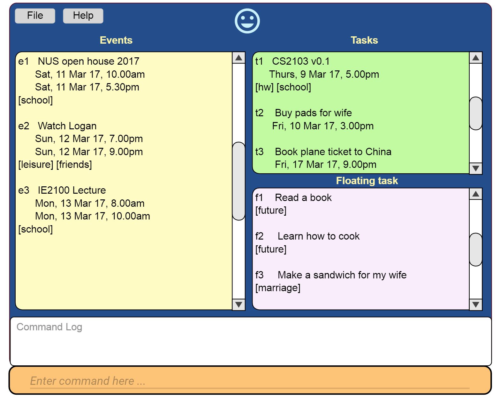

# Task Manager

 

* Task Manager is a desktop task management application that aims to make the way you record and search for tasks effortless. It has a GUI but most of the user interactions happen using
  a CLI (Command Line Interface) because you use your fingers well.
* Task Manager is specifically designed for the users who loves using the keyboard. Users of the application simply need to type the right keyword to invoke the necessary commands. 

#### Site Map
* [User Guide](docs/UserGuide.md)
* [Developer Guide](docs/DeveloperGuide.md)
* [Learning Outcomes](docs/LearningOutcomes.md)
* [About Us](docs/AboutUs.md)
* [Contact Us](docs/ContactUs.md)

#### Acknowledgements

* Some parts of this sample application were inspired by the excellent
  [Java FX tutorial](http://code.makery.ch/library/javafx-8-tutorial/) by *Marco Jakob*.

#### Licence : [MIT](LICENSE)
